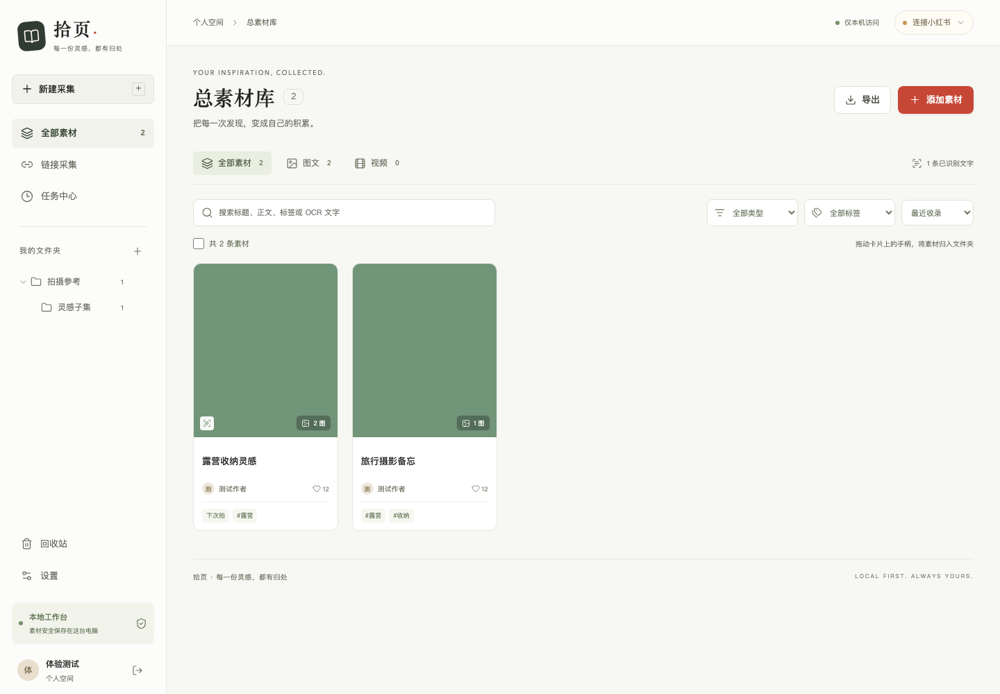
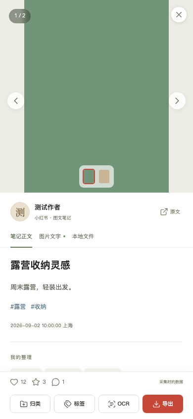

我在小红书里收藏了很多东西：旅行攻略、拍摄参考、产品案例、装修经验、工具清单。收藏那一刻，我总觉得自己已经把知识保存下来了。

可当我真正要做一份旅行计划、整理一套拍摄思路，或者比较十几篇产品分析时，问题就来了：**我记得自己收藏过，却很难把这些内容重新调动起来。**

一篇篇点开重看太慢；手动复制正文会漏掉图片里的信息；下载、截图，再切到另一个 AI 工具上传，三五篇还能忍，几十篇就足以让人放弃。于是收藏按钮慢慢变成了一种心理安慰：先收下，等有空再看。至于“以后”是什么时候，谁也不知道。

这大概就是“那就去我的收藏夹里吃灰吧”的完整形成过程。

问题并不是小红书缺少好内容。恰恰相反，它的问题在于好内容太多，而这些内容很难离开原来的产品边界，被用户重新组织和加工。平台出于版权、隐私、账号安全和自身商业边界的考虑，不提供开放的数据出口，我完全能够理解。但站在用户一边看，自己的收藏夹又确实是一笔长期积累下来的信息资产。

我想做的事情因此变得很具体：**能不能让用户把自己有权访问的笔记保存到本地，再像使用个人资料库一样搜索、分类、导出，并直接交给 AI 分析？**

这就是「拾页」的起点。

## 收藏不是知识，能够被再次调用才是

一开始，我把它理解成一个信息提取工具：输入小红书链接，拿到标题、正文、图片和视频，就算完成。

真正做起来之后，我发现“下载成功”只解决了最表面的一层。用户需要的并不是磁盘里多出几个文件，而是让一次偶然发现进入自己的工作流。

我把这条链路拆成了四步：

```text
发现一篇好内容
      ↓
完整保存正文、图片与视频
      ↓
识别图片文字，整理、搜索和归档
      ↓
把选中的素材交给 AI 比较、提炼和再创作
```

少了任何一步，收藏都很容易重新变成信息仓库里的沉积物。

这也改变了产品目标。「拾页」不应该只是一个更好看的爬虫界面，它应该成为一个本地素材工作台：前面接住小红书里的内容，后面连接用户自己的思考与创作。

## 第一座山：登录与请求签名

作为一个技术人员，我很快就看到了横在前面的第一座山：小红书 Web 请求并不是拼一个 URL 就能得到数据。账号凭据、请求参数和签名共同决定一次调用是否有效；签名脚本还会随着平台更新而变化。

这意味着，如果从零开始，我不仅要分析 `x-s`、`x-t`、`x-s-common` 等请求头如何生成，还要处理 Cookie 生命周期、二维码登录、短链展开、风控状态和接口字段变化。JS 逆向对我来说是一个完全陌生的领域，也是整个想法里最容易把项目拖死的一部分。

但开发产品不等于每个轮子都要自己造。既然我遇到了这个问题，GitHub 上大概率也有人遇到过。

我把需求和困难整理后交给 Grok，让它帮我搜索、比较相关开源项目。最后，我选择了一份已经具备小红书笔记、图片、视频和结构化信息采集能力的代码作为底座。当时我是沿着 MediaCrawler 这类关键词找到它的，后来把持续改造的版本放在了 [XHS-Info-collector](https://github.com/Fang-zhixian/XHS-Info-collector)。

这个选择帮我跨过了最陡的一段：项目已经包含 JS 签名桥接和基础 API 适配，我可以把精力放到自己真正想验证的产品闭环上。

不过，“找到开源项目”不等于“产品已经做好”。原来的能力主要面向命令行：参数、日志、目录和脚本对开发者没有问题，对普通用户却意味着很高的启动成本。接下来的工作，是把一组能运行的技术能力包装成一个人愿意反复使用的产品。

## 从一条命令，变成一个本地工作台

我给项目取名「拾页」。这个名字来自一个很直观的画面：不是把所有内容一扫而空，而是把真正有用的那一页拾起来，放回自己的知识体系。

目前的版本使用 React、TypeScript 和 Vite 构建前端，FastAPI 提供本地服务，SQLite 保存笔记索引、分类关系和任务状态，图片与视频仍然存放在本机文件系统。服务只监听 `127.0.0.1`，账号凭据和模型 Key 加密保存在本地。



用户第一次打开会创建本地管理员，然后在网页里扫描小红书登录二维码。登录成功后，凭据会被保存；之后输入单条分享链接、批量链接、作者主页、收藏页或关键词，就可以创建采集任务。

这里有一个看起来很小、实际很重要的技术细节：**登录失效和平台风控不是同一种错误。**

如果 Cookie 过期，正确动作是暂停任务，引导用户重新扫码，拿到新凭据后继续。如果遇到验证码、限流或平台拦截，继续自动重试只会让情况更糟。于是我把两者拆成了不同状态：前者等待登录并在成功后续跑，后者暂停并明确提示需要人工处理。

任务本身也不再是一段“关掉终端就消失”的进程。采集进度会写入 SQLite；网页关闭后任务仍在后台执行；服务重启时，可以从已完成的文件边界恢复。对于耗时较长的收藏夹和作者主页采集，这些工程细节决定了它究竟是一次演示，还是一个能日常使用的工具。

## 正文拿到了，信息可能还藏在图片里

跑通采集后，我很快碰到了第二个问题。

小红书是一种高度视觉化的内容形态。很多作者只在正文里写一句引子，真正的攻略、参数、清单和步骤都排在图片中。如果只保存接口返回的标题和正文，一篇十张图的教程最后可能只剩几十个字。文件是下载完整了，信息却没有完整进入知识库。

所以我在采集之后又加了一层 OCR。目前「拾页」可以连接兼容 PaddleOCR 协议的在线服务，对用户选中的图文素材执行识别。每张图片的结果单独保存为 Markdown，同时汇总进面向 AI 的 `note_ai_context.txt` 和 `note_ai_context.json`。

我没有把 OCR 默认绑定在每一次下载之后。原因很现实：识别有时间和额度成本，也并不是所有图片都有值得提取的文字。更合适的产品方式，是先完整保存素材，再让用户对真正需要深挖的内容按需识别。已经成功识别的图片会被跳过，异步任务中断后也可以继续查询结果。



到这一步，一条笔记不再只是一个链接。它包含了标题、作者、正文、原始标签、互动数据、本地图片或视频、OCR 文本，以及用户自己的文件夹和标签。搜索时，标题、正文、个人标签和 OCR 结果都可以成为入口。

从产品角度看，这一步是在把“内容”变成“可寻址的素材”。只有能够被找到、被组合，它才有机会参与下一次思考。

## 真正的目标，是让素材进入思考过程

采集和整理只是知识库的上半场。一个目录里就算有一千篇内容，如果每次使用仍要手动寻找、复制和上传，它依然很难进入日常工作。

所以我又做了一个 AI 对话原型。

用户可以在素材库中多选笔记，点击“问 AI”；也可以在对话框中输入 `@`，按标题、正文、作者、类型或文件夹寻找素材。一次对话可以组合多份图文和视频，让 AI 完成对比、提炼、行动清单或创作提纲。回答里保留素材引用，点击后可以回到原笔记核对上下文。

这里我刻意没有一上来就做“全库自动向量检索”。原型阶段更重要的是先验证一个基础问题：**当用户明确选中几份素材时，AI 是否真的能帮助他形成更好的结论？**

显式的 `@素材` 有三个好处。第一，用户知道哪些内容被发给了模型；第二，回答的依据更容易核对；第三，它减少了错误召回带来的干扰。等这条链路证明有价值，再加入混合检索和自动推荐，才不会为了“像一个知识库”而堆功能。

技术上，模型通过兼容 Chat Completions 的接口接入，回答以流式方式返回并保存到本地。图文素材会发送正文、已有 OCR 和经过压缩的抽样图片；视频目前只均匀抽取若干画面，并不会上传完整视频，也不会假装听过其中的声音。上下文和图片数量都有明确预算，用户可以停止生成，刷新后也能重新打开历史对话。

这些限制看起来保守，却是我希望保留的产品诚实：AI 看到什么、没看到什么，应该尽可能说清楚。

## 最难受的缺口，发生在最前面一步

做到这里，后面的闭环已经基本形成：采集、OCR、整理、搜索、导出、对话都可以在网页里完成。

但我最想要的那个体验，仍然没有实现。

理想流程应该是：我在小红书看到一篇有用的图文或视频，点分享，直接选择「拾页」，然后继续浏览。采集在后台完成，等我回到工作台时，内容已经在那里。

现实流程却是：点分享，复制链接，退出小红书，打开「拾页」，找到输入框，再粘贴。步骤并不算多，但它刚好打断了“发现内容”的连续体验。只要一天重复十几次，这点摩擦就足以让用户回到最熟悉的收藏按钮。

这是我做完原型后最明确的一条产品判断：**知识工具最大的竞争对手并不是另一个知识工具，而是用户当下那个不需要思考的动作。**

如果“保存到自己的知识库”比“点收藏”多出太多步骤，再强的 OCR 和 AI 都救不了留存。接下来最值得投入的，不是继续给后台增加十个高级功能，而是把这一公里压缩掉。

我会优先尝试系统分享扩展、移动端接收入口、浏览器扩展和剪贴板识别。哪条路真正可行，还取决于小红书是否把第三方应用暴露在分享链路中。如果源应用不给入口，就需要在系统能力允许的范围内寻找更短的替代路径，而不是假装已经实现了“无感”。

## 这个原型已经做到什么，还没有做到什么

现在的「拾页」已经可以完成：

- 网页扫码登录，并在本地加密保存账号凭据；
- 采集单条、批量、作者主页、收藏页和关键词结果；
- 保存标题、正文、图片、视频和结构化数据；
- 按需执行 PaddleOCR，把图片文字补进 AI 上下文；
- 用多层文件夹、个人标签、搜索和回收站管理素材；
- 导出原始媒体、TXT、JSON、OCR Markdown 和 Excel；
- 在 AI 对话中 `@` 多份图文或视频，流式生成并回看引用。

它仍然是一个基础原型。分享链路还不够顺；全库语义检索还没有接入；视频只有画面抽帧，没有语音转写；收藏夹增量同步、内容去重和一键安装也都需要继续打磨。小红书接口和签名会变化，平台风控也意味着这类工具必须克制请求频率，只处理自己有权访问的内容，并为失败留下清楚的人工处理边界。

接下来的路线很清楚：

1. **先缩短保存路径。** 让“看到—收进拾页”尽可能接近一个动作。
2. **补全视频信息。** 加入音轨提取和语音转写，让视频不再只是几张抽样画面。
3. **从手动引用走向可靠检索。** 将关键词、标签、文件夹和向量相似度结合起来，同时保留可解释的来源。
4. **支持收藏夹增量同步。** 识别新增、更新和失效内容，避免每次全量扫描。
5. **降低安装与维护成本。** 打包运行环境，给依赖、升级、备份和迁移提供可见的产品入口。

## 我从这次开发里重新理解了“个人知识库”

以前我会把知识库想成一个装资料的容器。文件越多、分类越细，好像就越接近“第二大脑”。

做完这一版之后，我更愿意把它理解为一条信息管道：入口足够轻，内容足够完整，整理方式符合自己的习惯，在需要时又能快速进入一个具体问题。容器只是中间状态，调用才是目的。

「拾页」现在还很早，甚至最影响体验的那一步仍然没有解决。但这个原型至少证明了一件事：散落在平台收藏夹里的内容，可以被带回本地，变成可搜索、可核对、可组合、可继续对话的个人素材。

收藏不应该是一次阅读的终点。它可以成为下一次思考的起点。
